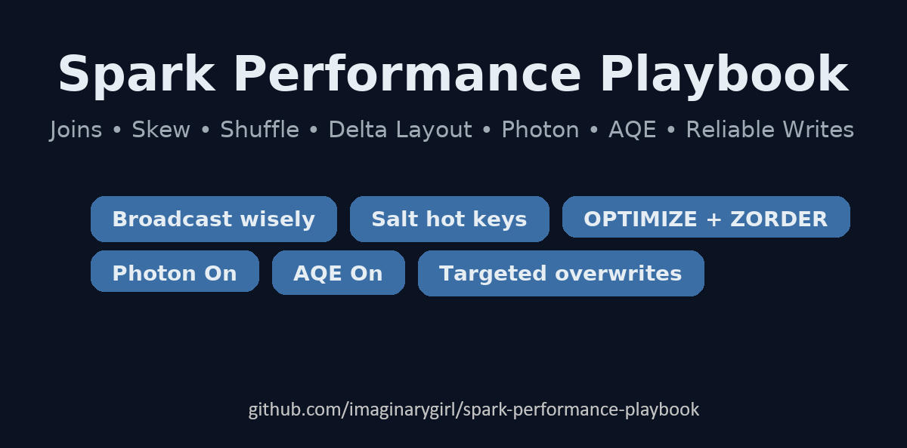

# Spark Performance Playbook (Databricks) for Busy Engineers

Practical, copy/paste-ready tips to speed up Spark jobs. 
Focus: joins, skew/shuffle, Delta layout, Photon & AQE, and production-grade writes. 
Aimed at busy data engineers who want wins fast.

<p align="center">
  
</p>

---

## 0) Golden rules
- **Prune early** (columns + rows) before joins/shuffles.
- **Pick the right join** (broadcast when you can; buckle partitions when you can’t).
- **Kill skew** (salt/coarsen hot keys, let AQE split skewed partitions).
- **Lay out Delta** for your queries (partition, OPTIMIZE, ZORDER).
- **Let Photon & AQE work** (turn them on, avoid UDFs, use built-ins).

---

## 1) Concepts: Spill, Skew, Shuffle

**Shuffle:** data moves across executors/partitions (joins, groupBy, window).
**Skew:** a few partitions/keys are much larger → long tail.
**Spill:** task runs out of memory → writes to disk (slow).

### How to Spot Them (Spark UI):
**Stage → Tasks:** sort by Duration, Shuffle Read, Spill desc.
**SQL tab**: confirm AQE actions (coalesced partitions, skew splits, broadcasts).

---

## 2) Joins (broadcast vs. shuffle)

### Detect skew

### Broadcast when one side is small
```python
# PySpark
small = dim_df.select("id", "flag").distinct()
big   = fact_df.select("id", "ts", "amount")

spark.conf.set("spark.sql.autoBroadcastJoinThreshold", 104857600)  # 100 MB
out = big.join(small.hint("broadcast"), "id", "left")
```

```sql
SET spark.sql.autoBroadcastJoinThreshold=104857600; -- 100 MB
SELECT /*+ BROADCAST(d) */
  f.*, d.flag
FROM fact f
LEFT JOIN dim d
ON f.id = d.id;
```

### Large–large joins: pre-aggregate + repartition on keys
```python
pre = big.groupBy("id").agg(F.sum("amount").alias("amt"))
left  = pre.repartition(400, "id")
right = other_large.repartition(400, "id")
out = left.join(right, "id", "inner")
```

---

## 3) Skew & Shuffle

### Detect skew
- Spark UI → SQL tab → Stage → Task time histogram: long tails = skew.
- Look for one partition doing “all the work”.

### Salt/coarsen hot keys
```python
# Add salt bucket to hot key
hot_keys = ["UNKNOWN", "NA"]
salted = df.withColumn(
  "id_salted",
  F.when(F.col("id").isin(hot_keys), F.concat_ws("_", F.col("id"), (F.rand()*16).cast("int")))
   .otherwise(F.col("id"))
)
out = left.join(right, left.id_salted == right.id_salted)
```

### Let AQE split skewed partitions (and coalesce small ones)
```python
spark.conf.set("spark.sql.adaptive.enabled", "true")
spark.conf.set("spark.sql.adaptive.skewJoin.enabled", "true")
spark.conf.set("spark.sql.adaptive.coalescePartitions.enabled", "true")
```
### Shuffle partition sizing (starting points)
- Daily/medium workloads: spark.sql.shuffle.partitions = 600
- Historical/heavy joins: = 2400 (adjust to cluster + data sizes)

---

## 4) Delta Layout (partitioning, OPTIMIZE, ZORDER)

### Partition only on selective, bounded columns
```sql
CREATE TABLE prod.sales_delta
USING DELTA
PARTITIONED BY (ymd, country)
AS SELECT * FROM source;  -- ensure (ymd, country) are in the data
```

### Compact small files and improve pruning
```sql
OPTIMIZE prod.sales_delta WHERE ymd BETWEEN 20251001 AND 20251031
ZORDER BY (customer_id, product_id);
```

### Housekeeping
```sql
-- tune for your governance policy
VACUUM prod.sales_delta RETAIN 168 HOURS; -- 7 days
```

---

## 5) Photon & AQE (let the engine help you)

### Photon
- Great for SQL/DataFrame heavy aggregations/joins.
```python
spark.databricks.photon.enabled=true;
```

### AQE smartness
- Coalesces small partitions, splits skewed partitions, and can switch join type at runtime.
```python
spark.sql.adaptive.enabled=true;
spark.sql.adaptive.skewJoin.enabled=true;
spark.sql.adaptive.coalescePartitions.enabled=true;
```

### Prefer built-ins
- Use expr(), window functions, and transform/filter/aggregate over Python UDFs. Vectorized IO loves it.

---

## 6) Writes, Reliability & Parallelism

### Control output parallelism (batch)
- Pick partitions consciously before write:
```python
target_files = 200                       # ~ desired number of files
df_to_write = df.repartition(target_files, "hash_key")  # stable partitioning
(df_to_write
  .write
  .format("delta")
  .option("maxRecordsPerFile", 2_000_000)  # size guard
  .mode("overwrite")
  .save(path))
```

### Rules of thumb:
- If you see a zillion tiny files, increase maxRecordsPerFile and/or reduce partitions (coalesce(n) right before the write).
- If a single task is huge/slow, increase partitions (repartition(n, *keys)), preferably on a high-cardinality key.

### Streaming: match write parallelism to input
```python
(df
  .writeStream
  .format("delta")
  .option("checkpointLocation", chkpt)
  .trigger(processingTime="1 minute")
  .foreachBatch(lambda batch, _: (
      batch.coalesce(64)               # shape the output per micro-batch
           .write
           .format("delta")
           .mode("append")
           .save(path)
  ))
  .start())
```
- Keep checkpoints stable; use foreachBatch to coalesce or repartition per trigger if needed.

### Targeted overwrites (replace only what changed)
```python
(df_to_write
  .write
  .format("delta")
  .mode("overwrite")
  .option("replaceWhere", "ymd = 20251015 AND customer_id = '9999'")
  .saveAsTable("sat023prdbus.tst.aldi_product_prices"))
```
- Safer & faster than full-table overwrites. Great for partitioned daily loads.

### File layout hygiene (Delta)
```sql
OPTIMIZE catalog.schema.table_name
ZORDER BY (customer_id, store_id);
```
- Use OPTIMIZE periodically; Z-Order on your join & filter keys.

### Enable writers
```python
spark.conf.set("spark.databricks.delta.optimizeWrite.enabled", "true")
spark.conf.set("spark.databricks.delta.autoCompact.enabled", "true")
```

### Skew-aware writes
- If a few keys are gigantic, salt them before the write to distribute work:
```python
from pyspark.sql import functions as F
salted = df.withColumn(
    "salt", F.when(F.col("hot_key") == 1, F.rand()*16).otherwise(F.lit(0)).cast("int")
)
salted.repartition("hot_key", "salt").write.format("delta").save(path)
```
- Combine with AQE (on by default) and Broadcast where appropriate.

### Photon = free speed
- Turn it on for faster & cheaper writes (and reads) with native vectorized engine:
```python
spark.conf.set("spark.databricks.photon.enabled", "true")
```

### Throughput tips
- Batch writes: coalesce/repartition to match file targets (e.g., ~128–256 MB).
- Avoid too many small files; use OPTIMIZE periodically.

---

## 7) Quick perf profile presets (tune to your need)

```python
def set_daily_defaults(spark):
    spark.conf.set("spark.sql.adaptive.enabled", "true")
    spark.conf.set("spark.sql.shuffle.partitions", "600")
    spark.conf.set("spark.sql.adaptive.coalescePartitions.enabled", "true")
    spark.conf.set("spark.sql.adaptive.skewJoin.enabled", "true")
    spark.conf.set("spark.databricks.photon.enabled", "true")

def set_historical_defaults(spark):
    spark.conf.set("spark.sql.adaptive.enabled", "true")
    spark.conf.set("spark.sql.shuffle.partitions", "2400")
    spark.conf.set("spark.sql.adaptive.coalescePartitions.enabled", "true")
    spark.conf.set("spark.sql.adaptive.skewJoin.enabled", "true")
    spark.conf.set("spark.databricks.photon.enabled", "true")
```

---

## 8) Troubleshooting checklist

- Plan explosion? → Prune columns early, cache only reused nodes.
- Skew? → Salt/coarsen keys, enable AQE skew split.
- Slow reads? → Missing partition filter or OPTIMIZE/ZORDER.
- Small files? → OPTIMIZE + adjust writer parallelism.
- UDFs everywhere? → Refactor to built-ins.

**Mantra**: _Prune early → Pick the right join → Kill skew → Lay out Delta → Photon + AQE → Solid writes._
